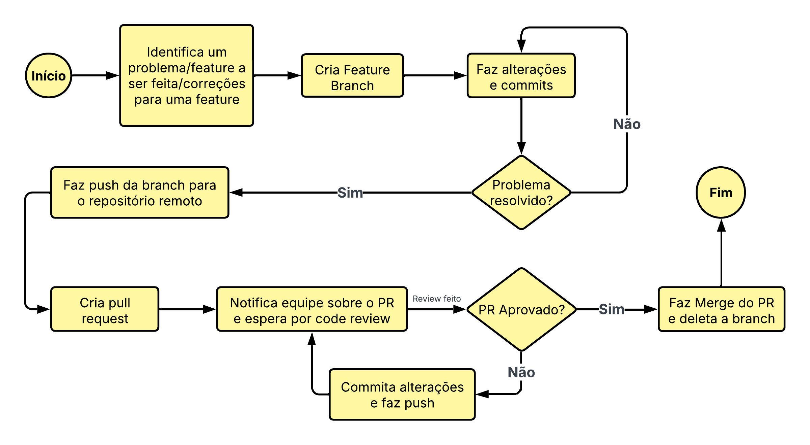

# Guia de boas práticas, convenções e procedimentos com o Git

---

# Sumário
1. [Convenções](#convenções)
2. [Comandos](#comandos)
    - [Clonar repositório](#1a-primeira-coisa-a-se-fazer-é-clonar-o-repositório-na-sua-máquina-para-fazer-isso-é-só-escrever-os-seguintes-comandos-no-terminal)
    - [Configurar usuário](#2-agora-devemos-fazer-a-configuração-do-seu-usuário-e-email-para-identificar-os-commits-que-faremos-mais-adiante)
    - [Mudar de branch](#3-depois-devemos-mudar-para-a-branch-a-qual-vamos-trabalhar)
    - [Criar nova branch](#4-para-criar-uma-branch-nova)
    - [Adicionar arquivos ao staging](#5-depois-de-estar-na-branch-certa-podemos-codar-ou-refatorar-o-código-para-salvar-as-alterações-devemos-adicionar-os-arquivos-ao-staging-com)
    - [Fazer o commit](#6-agora-devemos-fazer-o-commit-com)
    - [Subir o commit para o repositório remoto](#7-depois-de-fazer-o-commit-devemos-subir-para-o-repositório-remoto-com)
    - [Puxar mudanças do repositório remoto](#8-para-puxar-possíveis-mudanças-no-repositório-remoto-utilize)
    - [Deleter o último commit](#9-para-deletar-o-último-commit)
    - [Conferir status dos arquivos](#10-para-conferir-o-status-dos-arquivos-o-que-está-em-stage-para-ser-commitado-os-arquivos-que-foram-modificados-e-arquivos-novos-que-não-estão-rastreados)
    - [Ver a diferença do que foi / não foi commitado](#11-para-ver-as-diferenças-não-commitadas)
    - [Ver o histórico de commits](#12-para-conferir-o-histórico-de-commits)
    - [Fazer o merge](#13-depois-de-concluir-todas-as-alterações-na-branch-voce-deve-realizar-um-merge-primeiro-vá-para-a-branch-que-irá-receber-as-alterações-ex-caso-vc-queira-mesclar-uma-branch-feature-a-branch-develop-vc-deve-estar-na-branch-develop-com-git-checkout-develop-e-depois)
    - [Atualizar a feature com git rebase](#14-uma-opção-também-é-o-git-rebase-que-ao-invés-de-fazer-um-merge-comum-você-atualiza-a-feature-com-os-commits-mais-recentes-da-develop-evitando-merge-commits-desnecessários-e-organizando-melhor-o-histórico-de-commits-então-vá-para-a-branch-feature-com-git-checkout-feature-e-depois)
    - [Deletar uma branch](#15-depois-de-dar-merge-podemos-deletar-a-brach)
    - [Marcar o commit com tag](#16-depois-de-qualquer-merge-na-branch-main-devemos-marcar-com-um-tag-de-versão-com)
3.  [Como funciona o gitflow](#como-funciona-o-git-flow)
4. [Tabela comparativa comandos git X comandos da CLI git flow](#tabela-comparativa-comandos-básicos-do-git-x-comandos-do-cli)
5. [Pull Request](#pull-request)

---

# Convenções

### 1. Fazer commits com mensagens de fato descritivas, usando o tempo verbal no imperativo como: "adicionA-login" ou "corrigE-erro-no-crud" para lermos: "**esse commit** ... adiciona login ou adiciona crud"
### 2. Proibido fazer ```git commit -m "."``` ou 'git commit -m " :pray: " ' ou qualquer coisa do tipo
### 3. Estaremos utilizando o git flow para ver como funciona o fluxo do git flow [clique aqui](#como-funciona-o-git-flow):
### 4. Evitar fazer commits gigantes
### 5. Evitar fazer branches gigantes (os pontos 4 e 5 são para não termos que resolver conflitos gigantes e melhorar na hora de revisão)
### 6. Criar branches com o nome no infinitivo como: "adicionAR-login" ou "corrigIR-erro-no-crud"
## Convenções sobre PRs
### 7. Descreva o PR incluindo o propósito, o que foi feito e como testar.
### 8. Adicione revisores garantindo que o time revise antes do merge.
### 9. Teste antes de submeter: Certifique-se de que o código compila e os testes passam.
### 10. Mantenha PRs pequenos: Facilita a revisão e reduz conflitos.

---

# Comandos

### 1.	A primeira coisa a se fazer é clonar o repositório na sua máquina, para fazer isso é só escrever os seguintes comandos no terminal: 

- clonar o repositório:
```
git clone <url-do-repositório> 
```
- Caso queira começar um repositório novo a partir da sua máquina local:
```
git init <nome_do_repositório>
```
- Depois de criar um repositório local novo vamos criar um repositório remoto e conectar a ele:
```
git remote add origin <URL_do_repositório_remoto>
```
- OBS: **Não** inicialize o repositório remoto com README ou outros arquivos se você já tem um repositório local, para evitar conflitos. Apenas crie um repositório vazio.

### 2. Agora devemos fazer a configuração do seu usuário e email para identificar os commits que faremos mais adiante:
- inserindo seu nome
```
git config --global user.name "<seu_nome>"
```
- inserindo seu email
```
git config --global user.email "<seu_email>"
```

### 3. Depois devemos mudar para a branch a qual vamos trabalhar: 
```
git checkout <nome_da_branch>
```
- ou 
```
git switch <nome_da_branch>
```

### 4. Para criar uma nova branch:
```
git branch <nome_da_branch>
```
- Para criar uma nova branch e já mudar para ela:
```
git checkout -b <nome_da_branch>
```
- ou 
```
git switch -c <nome_da_branch>
```
- Para listar todas as branches apenas:
```
git branch
```

### 5. Depois de estar na branch certa podemos codar ou refatorar o código. Para salvar as alterações devemos adicionar os arquivos ao "staging" com:
```
git add <nome_do_arquivo>
```
- ou para adicionar todos os arquivos que foram modificados
```
git add .
```

### 6. Agora devemos fazer o commit com:
```
git commit -m "<mensagem do commit>"
```
- para corrigir a mensagem do último commit em caso de erro
```
git commit --amend -m "<nova mensagem do commit>"
```
- caso queira fazer uma descrição longa para o commit use:
```
git commit -m "<mensagem curta>" -m "<descrição longa>"
```

### 7. Depois de fazer o commit devemos subir para o repositório remoto com:
```
git push origin <nome da branch>
```

### 8. Para puxar possíveis mudanças do repositório remoto utilize:
```
git pull origin <nome_da_branch>
```
- caso queira puxar sem mesclar as mudanças com o que vc tem na sua máquina utilize:
```
git fetch
```

### 9. Para deletar o último commit:
```
git reset --soft HEAD~1
```
- No caso acima ele apaga o último commit porém mantém as alterações no staging, ou seja, as alterações feitas são mantidas podendo ser commitadas novamente, já se quiser apagar completamente o commit use: 
```
git reset --hard HEAD~1
```
- Isso deleta o commit e apaga as alterações que estavam no staging, ou seja, tudo que foi criado / atualizado nesse commit é desfeito.

### 10. Para conferir o status dos arquivos (o que está em stage para ser commitado, os arquivos que foram modificados e arquivos novos que não estão rastreados):
```
git status
```
- Dica: é melhor de ver essas diferenças pela própria interface do Vs Códigos

### 11. Para ver as diferenças não commitadas:
```
git diff
```

### 12. Para conferir o histórico de commits:
```
git log
```

### 13. Depois de concluir todas as alterações na branch voce deve realizar um merge, **primeiro vá para a branch que irá receber as alterações** (ex: caso vc queira mesclar uma branch feature a branch develop vc deve estar na branch develop) com ```git checkout develop``` e depois:
```
git merge feature/<nome_da_feature>
```
### 14. Uma opção também é o git rebase, que ao invés de fazer um merge comum, você atualiza a feature com os commits mais recentes da develop, evitando merge commits desnecessários e organizando melhor o histórico de commits, então vá para a branch feature com ```git checkout feature``` e depois:
```
git rebase <nome_da_develop>
```
- isso reorganiza o histórico de commits, atualizando a feature do ponto mais atualizado da branch develop

### 15. Depois de dar merge podemos deletar a brach:
```
git branch -d feature/<nome_da_feature>
```
- Para deletar uma branch que foi criada com o nome errado usamos:
```
git branch -D feature/<nome_da_feature>
```
- Do modo acima o git não se importa se a branch já foi mesclada ou não (com o 'd' minúsculo o git não exclui sem ter feito merge, dá erro)

### 16. Depois de qualquer merge na branch main devemos marcar com um tag de versão com:
```
git tag -a <nome_da_tag> -m "<descrição_da_tag>"
```
- Do modo acima marcamos o último commit (HEAD) com a tag, mas se quisermos marcar um commit anterior fazemos:
```
git tag -a <nome_da_tag> <ID_do_commit> -m "<descrição_da_tag>"
```
- Para ver todas as tags do repositório:
```
git tag
```
- Para ver com mais detalhes, ver a descrição da tag:
```
git show <nome_da_tag>
```
- As tags não são enviadas automaticamente ao repositório remoto por isso use:
```
git push origin <nome_da_tag>
```
- Para enviar todas as tags de uma vez:
```
git push origin --tags
```
- Para deletar uma tag localmente:
```
git tag -d <nome_da_tag>
```
- Para deletar uma tag remotamente:
```
git push origin --delete <nome_da_tag>
```

---

# Como funciona o git flow


Gitflow é uma estratégia de branching (ramificação) que organiza o trabalho em equipe. As principais branches são:

- main: Contém o código estável e pronto para produção.

- develop: Integra funcionalidades em desenvolvimento, ainda não prontas para produção.

- feature/*: Branches temporárias para desenvolver novas funcionalidades (ex.: feature/nova-funcionalidade).

- hotfix/*: Branches para corrigir bugs urgentes em produção (ex.: hotfix/corrigir-bug-login).

- release/*: Branches para preparar uma nova versão para produção (ex.: release/v1.0.0).

Dica: Sempre comece entendendo o estado atual do repositório com git branch ou git log.

- A **branch main e a branch develop** são as únicas branches permanentes
- teremos uma **branch feature** (que sempre sai da branch develop) para cada nova funcionalidade do nosso projeto, depois são mergeadas de volta a branch develop
- as **branches release** (não pode haver mais de uma branch desse tipo simultaneamente) saem da branch develop e servem para testar e corrigir uma nova versão a ser lançada, quando finalizar esse processo ela será mergeada tanto na main, gerando uma nova tag de versão, quanto na develop
- por último as **branches hotfix**, que servem para consertar erros críticos em produção, saem da branch main e são mergeados tanto na main gerando uma nova tag ([comandos para gerar tag](#16-depois-de-qualquer-merge-na-branch-main-devemos-marcar-com-um-tag-de-versão-com)) quanto na develop.

- OBS: Na nossa equipe, iremos considerar o uso de um Hotfix como desleixo e falta de preparo, pois estamos desenvolvendo algo voltado à escola de TI e não temos usuários utilizando a versão de produção. Então não utilizaremos a branch hotfix.

caso não tenha ficado muito claro, como funciona o gitFlow veja o [artigo da alura](https://www.alura.com.br/artigos/git-flow-o-que-e-como-quando-utilizar) à respeito

## Existem duas formas de implementar o Git Flow, a primeira é utilizar os comandos básicos do Git, a outra é utilizar uma CLI que ajuda a simplificar o fluxo do Git Flow.

- Para instalar o CLI do git flow:  
    - OSX: brew install git-flow
    - Linux: apt install git-flow
    - Windows: https://git-scm.com/download/win (Já está incluído no Git a partir da versão 2.5.3.)

# Tabela comparativa comandos básicos do git x comandos do CLI

| **Operação** | **Forma tradicional** | **Comandos do CLI** |
| - | - | - |
| Criar uma Branch Develop a partir da Branch Master | git checkout -b develop | git flow init |
| Criar uma feature | git checkout develop<br>e<br>git checkout -b name-feature | git flow feature start <nome_da_feature>  |
| Mergear uma feature | git checkout develop<br>e<br>git merge <nome_da_feature> | git flow feature finish <nome_da_feature> |
| Criar uma release | git checkout develop<br>e<br>git checkout -b release/1.0.0 | git flow release start 1.0.0 |
| Mergear uma release | git checkout main<br>e<br>git merge release/1.0.0 <br>e<br>git checkout develop<br>e<br>git merge release/1.0.0<br>e<br>git tag 1.0.0 | git flow release finish 1.0.0 |
| Criar um hotfix | git checkout main<br>e<br>git checkout -b hotfix/<nome_do_hotfix> | git flow hotfix start <nome_do_hotfix> |
| Mergear um hotfix | git checkout main<br>e<br>git merge hotfix/1.0.0<br>e<br>git checkout develop<br>e<br>git merge hotfix/1.0.0<br>git tag 1.0.0 | git flow hotfix finish 1.0.0 |

- Podemos ver o quão útil é a CLI do Git-flow, pois simplifica o processo e nos ajuda a não cometer erros, principalmente lidando com as releases e os hotfixes. 

---

# Pull Request

- Um Pull Request (PR) é uma proposta de integração de código. Ele serve como um checkpoint para revisão e aprovação antes do merge, garantindo qualidade e alinhamento com o projeto.
  


No fluxo GitFlow, PRs são usados para integrar branches feature, hotfix ou release na develop ou main, permitindo discussões, revisões e resolução de conflitos antes da fusão

- Após finalizar suas alterações e enviar sua brach para o repositório remoto, o próximo passo é abrir um Pull Request (PR) para que o código possa ser enviado e mesclado

- certifique que a sua branch está atualizada com a develop utilizando ```git rebase develop``` e então crie o pull request com:

```
gh pr create --base develop --head feature/<nome da feature> --title "Título do PR" --body "Descrição co PR"
```
- para listar os PR abertos:
```
gh pr list
```
- para aprovar um PR:
```
gh review <ID_do_PR> --approve
```
- para mesclar um PR via terminal:
```
gh pr merge<ID_do_PR> --squash --delet-branch
```
